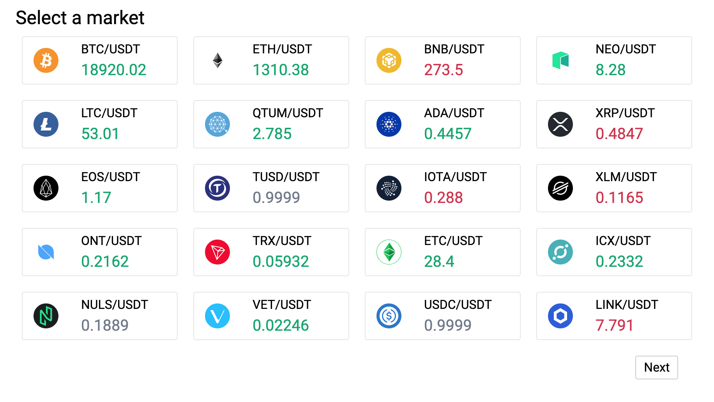
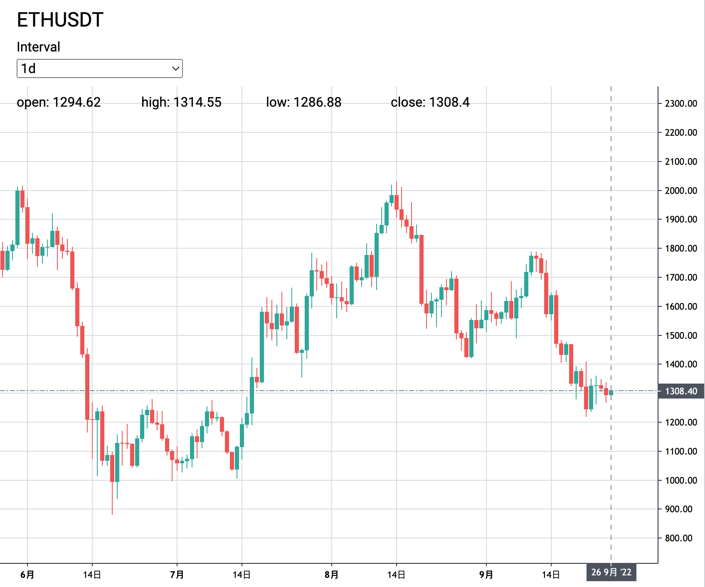

# Crypto currency chart

Crypto currency chart is a simple website displaying realtime-data from [Binance](https://www.binance.com/).

## Features

- Lazy load history price data.
- Real-time price.
- Price up and down in the period indicated by color.




### Getting Started

#### Prerequisites

- nodejs
- npm
- yarn

#### STEP 1: Cloning the project from git repository

```sh
git clone https://github.com/garconbenjamin/crypto-chart
```

#### STEP 2: Redirect to project root dir

```sh
$ cd crypto-chart
```

#### STEP 3: Install all project dependencies

```sh
$ yarn install
```

### Development & Running

You can start the application by simply executing the following command in the terminal

```sh
$ yarn start
```
